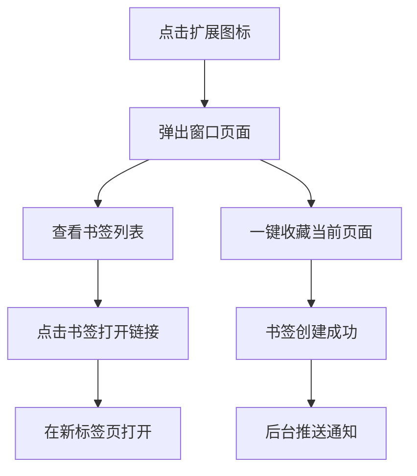

# BookmarkManager 产品需求文档

## 1. 产品概述

BookmarkManager是一个高级书签管理器浏览器扩展，旨在接管和增强浏览器原生的收藏夹功能，为用户提供更便捷、高效的书签管理体验。

该产品解决了原生书签管理功能不够直观、操作繁琐的问题，主要面向需要频繁管理大量书签的用户，通过提供一键收藏、可视化管理等功能显著提升用户的浏览效率。

## 2. 核心功能

### 2.1 用户角色

本产品采用单一用户模式，无需区分用户角色，所有功能对安装扩展的用户开放。

### 2.2 功能模块

我们的BookmarkManager扩展包含以下主要页面：

1. **弹出窗口页面**：书签展示区域、一键收藏按钮、书签列表管理
2. **后台服务**：书签事件监听、通知推送、数据同步

### 2.3 页面详情

| 页面名称 | 模块名称 | 功能描述 |
|----------|----------|----------|
| 弹出窗口页面 | 书签展示区域 | 以树形结构显示所有书签和文件夹，支持点击打开链接 |
| 弹出窗口页面 | 一键收藏按钮 | 快速收藏当前活动标签页到书签列表 |
| 弹出窗口页面 | 书签列表管理 | 递归展示书签文件夹结构，区分文件夹和链接显示 |
| 后台服务 | 书签事件监听 | 监听书签的创建、删除、移动等操作事件 |
| 后台服务 | 通知推送 | 在书签操作完成后向用户推送通知消息 |

## 3. 核心流程

用户主要操作流程如下：

1. 用户点击浏览器工具栏上的扩展图标
2. 弹出窗口显示当前所有书签的树形结构
3. 用户可以点击书签链接在新标签页中打开
4. 用户点击"一键收藏"按钮可将当前页面添加到书签
5. 后台服务监听书签变化并推送相应通知

## 4. 用户界面设计

### 4.1 设计风格

- **主色调**：蓝色系（#007bff主色，#0056b3悬停色）
- **按钮样式**：圆角矩形按钮，扁平化设计
- **字体**：无衬线字体（sans-serif），标题16px，正文默认大小
- **布局风格**：简洁的列表式布局，固定宽度弹窗设计
- **图标风格**：使用📁文件夹emoji图标，简洁直观

### 4.2 页面设计概览

| 页面名称 | 模块名称 | UI元素 |
|----------|----------|--------|
| 弹出窗口页面 | 标题区域 | 居中显示"我的书签"标题，深灰色文字(#333) |
| 弹出窗口页面 | 书签展示区域 | 无序列表布局，文件夹加粗显示，链接蓝色可点击 |
| 弹出窗口页面 | 操作按钮 | 全宽蓝色按钮，白色文字，悬停变深蓝色 |

### 4.3 响应式设计

该产品为桌面浏览器扩展，采用固定宽度设计（300px），无需考虑移动端适配，主要优化鼠标点击交互体验。