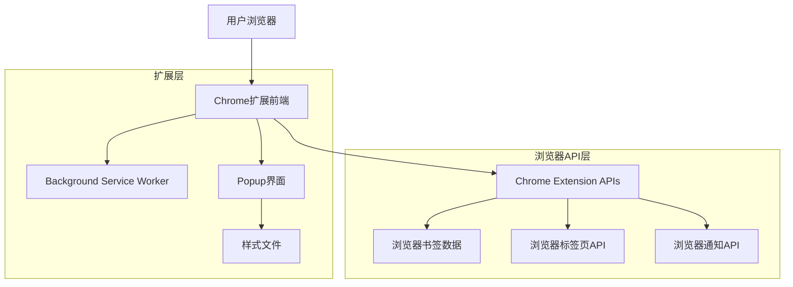
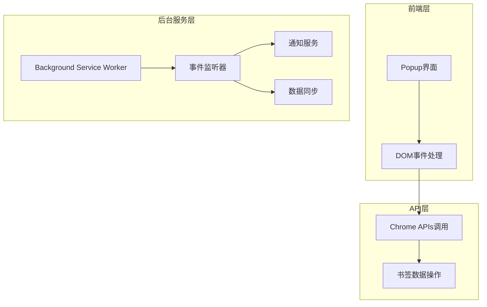
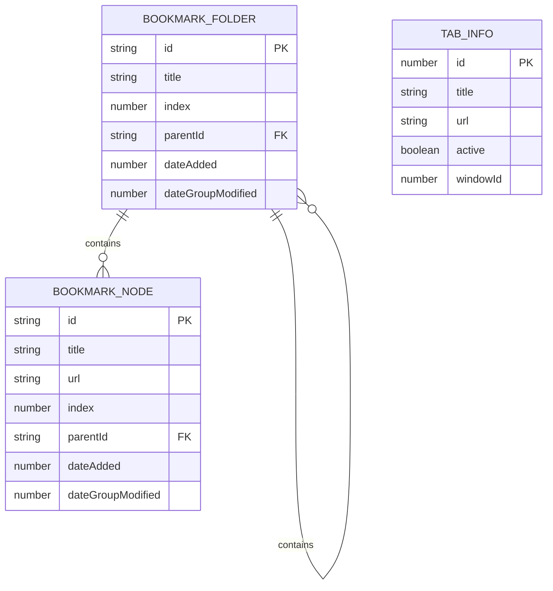

# BookmarkManager 技术架构文档

## 1. 架构设计



## 2. 技术描述

* 前端：原生HTML + CSS + JavaScript（Chrome Extension Manifest V3）

* 后端：无（使用Chrome Extension Service Worker）

## 3. 数据服务

* Chrome Bookmarks API：存储和管理用户书签数据

* Chrome Tabs API：获取当前活动标签页信息

* Chrome Notifications API：推送书签操作通知

## 4. API定义

### 4.1 核心API

**书签管理相关**

```javascript
// 获取书签树
chrome.bookmarks.getTree(callback)

// 创建书签
chrome.bookmarks.create({
  title: string,
  url: string
}, callback)

// 监听书签创建事件
chrome.bookmarks.onCreated.addListener(callback)

// 监听书签删除事件
chrome.bookmarks.onRemoved.addListener(callback)
```

**标签页管理相关**

```javascript
// 获取当前活动标签页
chrome.tabs.query({
  active: true,
  currentWindow: true
}, callback)
```

**通知推送相关**

```javascript
// 创建通知
chrome.notifications.create({
  type: 'basic',
  iconUrl: string,
  title: string,
  message: string
})
```

## 5. 服务架构图



## 6. 数据模型

### 6.1 数据模型定义



### 6.2 数据定义语言

**书签节点数据结构**

```javascript
// 书签节点接口定义
interface BookmarkTreeNode {
  id: string;                    // 书签唯一标识符
  title: string;                 // 书签标题
  url?: string;                  // 书签URL（文件夹无此字段）
  index?: number;                // 在父节点中的位置
  parentId?: string;             // 父节点ID
  dateAdded?: number;            // 创建时间戳
  dateGroupModified?: number;    // 修改时间戳
  children?: BookmarkTreeNode[]; // 子节点数组（仅文件夹有）
}

// 标签页信息接口
interface Tab {
  id: number;        // 标签页ID
  title: string;     // 页面标题
  url: string;       // 页面URL
  active: boolean;   // 是否为活动标签页
  windowId: number;  // 所属窗口ID
}

// 通知配置接口
interface NotificationOptions {
  type: 'basic';           // 通知类型
  iconUrl: string;         // 图标路径
  title: string;           // 通知标题
  message: string;         // 通知内容
}
```

**扩展配置文件结构**

```json
// manifest.json 配置结构
{
  "manifest_version": 3,
  "name": "高级书签管理器",
  "version": "1.0",
  "description": "一个用于搜索、添加和管理书签的浏览器扩展。",
  "permissions": [
    "bookmarks",
    "activeTab",
    "notifications"
  ],
  "icons": {
    "16": "icons/icon16.png",
    "48": "icons/icon48.png",
    "128": "icons/icon128.png"
  },
  "action": {
    "default_popup": "popup.html",
    "default_title
```

